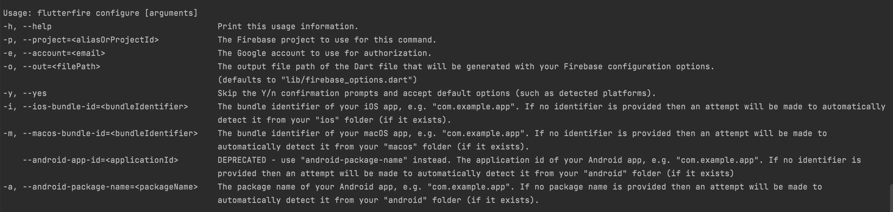

# clean_architecture

Template Flutter application with clean architecture structure

## FVM Installation

https://fvm.app/docs/getting_started/installation

- If you're using fvm,run "fvm flutter pub get" instead of "flutter pub get". Add fvm before flutter
  command.

## Getting Started

- Flutter version using : 3.0.4 (stable at 1/7/2022)
- Dart version using : 2.17.5
- DevTools version using : 2.12.2
- Platform android : 32, Build-tools : 32.1.0-rc1
- Java version OpenJDK 11.0.12
- Gradle version 7.2
- Build:gradle 7.1.3
- XCode: 13.4.1
- CocoaPods version 1.11.3
- Flutter extension version (Android Studio: 69.0.2, VsCode: 3.44.0)

### Configuration Environment Running

- ANDROID STUDIO

Step 1 : Open " Run => Edit Configuration in Android Studio"

Step 2 : Create new Configuration with build flavor value is :

+ Dev Environment : dev
+ Staging Environment : staging
+ Production Environment : production

- VS Code

Step 1 : Open " Run => Open Configuration in VS Code"

Step 2 : Create new Configuration with build flavor value is :

+ Dev Environment : dev
+ Staging Environment : staging
+ Production Environment : production
+ If you want run on release mode, please add "flutterMode": "release" into config object

- Example dev environment:

```
 {
            "name": "dev",
            "request": "launch",
            "type": "dart",
            "args": [
                "--flavor",
                "dev"
            ]
        },
```

### Command need to run before run app

- For developer, please
  install [lefthook](https://github.com/evilmartians/lefthook/blob/master/docs/node.md) before
  start, it'll help you format code, analyze while commit.
- Please install [flutter plugin](https://docs.flutter.dev/get-started/editor) first.
- Please run script "setup_app.sh" in terminal (On MacOS if can't run this script please try "sh
  setup_app.sh")

### Linter

- We're using two linter library, first
  is [flutter_lint](https://pub.dev/packages/flutter_lints/install), second
  is [dart_code_metrics](https://pub.dev/packages/dart_code_metrics) that'll help our code following
  coding convension better.

### Build APK

- flutter build apk --flavor {flavorOnStep2}
- Ex: flutter build apk --flavor dev

### Build IPA without archive on Xcode

- flutter build ipa --flavor {flavorOnStep2} --export-options-plist=ios/Runner/ExportOptions.plist
- Ex: flutter build ipa --flavor dev --export-options-plist=ios/Runner/ExportOptions.plist

### Project architecture (Clean Architecture Approach)

1. Why:
    * We want to separate what type of database that we use for storage (might want to change it
      later on)
    * To adhere SOLID principles since we are using OOP for this project.
    * Ensuring UI layers don't know what is going on at data layer at all.
    * Might want to separate each layers into different packages.
2. Presentation - Domain - Data.
3. Presentation layer consist of
    * Widgets
    * BLoC
        * Bloc only manages UI state based on business logic
4. Domain layer (Business logic layer)
    * Repositories (interfaces aka idea how the logic would behave)
    * Entities (or models which what UI needs)
    * Usecases (user stories)
        * Typically one function, but can be more if they are functionality related.
        * Remember, one class for one responsibility.
5. Data layer
    * Data Sources
        * remotes (API)
        * locals (Database)
    * Models
        * request
        * response
    * Repositories (Implementation from Domain layer)
6. More insight of layers
   
7. The inner layer should **NOT** know what the outer layer has / do.
8. Reference:
    1. https://github.com/ResoCoder/flutter-tdd-clean-architecture-course
    2. https://github.com/ShadyBoukhary/flutter_clean_architecture (We don't use this plugin)
    3. https://blog.cleancoder.com/uncle-bob/2012/08/13/the-clean-architecture.html

## Project Structure

```
project
|--.fvm                                              # fvm config using for project
|   |--fvm_config.json                               # config file
|--android                                           # android project dir
|--assets                                            # application all assets
|   |--images                                        # application image assets
|   |--fonts                                         # application font assets
|--fastlane                                          # config ci/cd using fastlane
|--ios                                               # ios dir
|--lib                                               # main project dart lib entry point
|   |--app                                           # application layer for clean architecture 
|   |   |--core                                      # core folder include string extension,...
|   |   |--di                                        # dependencies injection registration for project
|   |   |--manager                                   # manager folder include style manager, other resource manager
|   |   |--multi-languages                           # localization for project, using easy_localization and google sheet generator csv
|   |   |--route                                     # route config for project, include generateRoute and route define all screen of project
|   |   |--utils                                     # utils for application layer
|   |   |--app.dart                                  # library app_layer using for import and combine most of application layer files
|   |--data                                          # data layer for clean architecture 
|   |   |--login                                     # login feature folder
|   |   |   |--api                                   # api folder
|   |   |   |   |--login_api.dart                    # login abstract class for retrofit
|   |   |   |   |--login_api.g.dart                  # login generator class for retrofit
|   |   |   |--models                                # models folder for data layer
|   |   |   |   |--request                           # request model folder
|   |   |   |   |--response                          # response model folder
|   |   |   |--repositories                          # repositories folder for data layer
|   |   |   |   |--login_repository_impl             # repository impl will extend from login_repository abstract class
|   |   |--utils                                     # utils for data layer
|   |   |   |--exceptions                            # custom exception for data layer
|   |   |   |--interceptors                          # custom interceptors for data layer
|   |--domain                                        # domain layer for clean architecture 
|   |   |--login                                     # login domain feature folder
|   |   |   |--entities                              # entities folder
|   |   |   |   |--user_entity.dart                  # user entity will extends from login_response.dart
|   |   |   |--repositories                          # abstract class for login feature
|   |   |   |--usecases                              # usecases for login feature
|   |--firebase                                      # firebase config for app that generated by Firebase CLI 
|   |--presentation                                  # presentation layer for clean architecture 
|   |   |--common                                    # common widget or common screen
|   |   |--login                                     # login presentation layer
|   |   |   |--bloc                                  # login bloc for whole login screen
|   |   |   |--ui                                    # ui folder for login feature
|   |   |   |   |--login_screen.dart                 # login ui frame
|   |   |   |   |--widgets                           # widgets folder for nested widget in login feature
|   |   |   |--login_route.dart                      # login route class define BlocProvider for Bloc class of login feature
|   |--main.dart                                     # main config Material App and runApp
|--scripts                                           # folder contain scripts file make easier to combine command 
|--test                                              # unit test
|--web
|--.gitignore                                        # ignore file of git
|--README.md                                         # ReadMe for this project
|--analysis_options.yaml                             # lint rule configuration, config rule here
|--.gitlab-ci.yml                                    # config ci/cd for gitlab
|--pubspec.yaml                                      # dart package management file, add new dependencies here
|--setup_app.sh                                      # Script set up app before run app

```

### Configure Firebase Multi Flavor

Step 1 : Install Firebase CLI with npm : "npm install -g firebase-tools"

https://firebase.google.com/docs/cli#install-cli-mac-linux

Step 2 : Login to firebase account : "firebase login"

Step 3 : Install FlutterFire CLI with this command : "dart pub global activate flutterfire_cli"

Step 4 : Configure multi flavor with:

Run command "flutterfire configure -i packageName -a packageName -o lib/firebase/firebase_options_
{flavor}.dart" for each flavor.

Dev: "flutterfire configure -i com.vmo.c3FlutterTemp.dev -a com.vmo.c3FlutterTemp.dev -o
lib/firebase/firebase_options_dev.dart"

Staging: "flutterfire configure -i com.vmo.c3FlutterTemp.staging -a com.vmo.c3FlutterTemp.staging -o
lib/firebase/firebase_options_staging.dart"

Production: "flutterfire configure -i com.vmo.c3FlutterTemp -a com.vmo.c3FlutterTemp -o
lib/firebase/firebase_options.dart"

Other configure:


Documentation at : https://firebase.google.com/docs/flutter/setup?platform=ios

### Injections

1. We are using [get_it](https://pub.dev/packages/get_it) for injections. It is fun because we can
   start the service locator and use it everywhere when needed because they are injected at
   top-level in main.dart.
2. Only use it upon initialization

```
getIt.registerSingleton<LoginBloc>(LoginBloc(
    loginUseCase: LoginUseCase(getIt<LoginRepositoryImpl>()),
  ));
```

and use it on `route`

```
BlocProvider<LoginBloc>(
    create: (_) => getIt.get<LoginBloc>(),
),
```

for reusing the `BLoC`,

```
BlocProvider.value(
    value: getIt.get<PumpsBloc>(),
)
```

for usage (in Widgets), **always** use

`context.read<PumpsBloc>().add(AddPumps());`

instead of

`getIt.get<PumpsBloc>().add(AppPumps());`

For non widget usage, manually inject the object on initialization.

### Localization

We are using [Easy Localization](https://pub.dev/packages/easy_localization) to handle
multi-languages.
Using [Google Sheet Generator](https://github.com/Hoang-Nguyenn/easy_localization_generator) on
cloud will take less effort for change and update key and value. Only need update in google sheet
file.

Google sheet sample on this project :
"https://docs.google.com/spreadsheets/d/1SpiJWFRfJaIRnzpEc0mJ2WaaI9JYlz8jKBPduAPzdXE/edit#gid=1013756643"

Step to set-up google sheet :

- 1 : Create a CSV Google Sheet with form like that form
  "https://docs.google.com/spreadsheets/d/1SpiJWFRfJaIRnzpEc0mJ2WaaI9JYlz8jKBPduAPzdXE/edit#gid=1013756643"
- 2 : Enable share for anyone have this link
- 3 : on file locale_keys.dart in lib/utils/multi-languages/locale_keys.dart change docId annotation
  with your google sheet docid Example of DocID is :
  "https://docs.google.com/spreadsheets/d/1SpiJWFRfJaIRnzpEc0mJ2WaaI9JYlz8jKBPduAPzdXE (it's docId)
  /edit#gid=1013756643"
- 4 : run terminal : "flutter pub run build_runner build" to generate .g.dart localization file
- 5 : When update new value on google sheet should update plus one version on SheetLocalization at
  locale_keys.dart and run "flutter packages pub run build_runner build" again to get new file csv

Step to use multi-languages import in code:

- Remember import file "multi_languages_utils.dart" instead of "locale_keys.dart" because first file
  already import library easy_localization extension,you no need to use 2 import

- Using : LocaleKeys.keyDefine.tr()  (tr() is using to change languages with current languages
  setup, remember have it)

Link library : https://pub.dev/packages/easy_localization
Link plugin generate csv from google
sheet : https://github.com/Hoang-Nguyenn/easy_localization_generator

### Json parsing / serialization

This project is implementing [json_serializable](https://pub.dev/packages/json_serializable). It use
build_runner to generate files. If you make a change to these files, you need to re-run the
generator using build_runner:

```
flutter pub run build_runner build
```

generator using build_runner and remove conflict file :

```
flutter pub run build_runner build --delete-conflicting-outputs
```

### Dio Interceptor

- This project using [pretty_dio_logger](https://pub.dev/packages/pretty_dio_logger) for display log
  in console and [alice](https://pub.dev/packages/alice) inspector http request in UI for debugging.

## Assets

- Image is handled by [flutter_gen](https://pub.dev/packages/flutter_gen) for auto-complete and not
  have to deal with typing mistakes.
- To setup flutter_gen, run `dart pub global activate flutter_gen`

### Adding new Assets

- Add asset(s) into `assets/<asset types>`
- Run `flutter pub run build_runner build` in console
- New image(s) will appear in `lib/gen/assets`

### Remove Asset(s)

- Delete assets from `assets/<asset types>`
- Run `flutter pub run build_runner build` in console
- `lib/gen/assets` will be updated with currently available assets.

### How to change version number and version code :

- Go to pubspec.yaml => line version to change :
- Example : 1.0.10+3 => Version name : 1.0.10, Version code : 3

### Step to change package name

- We using library [change_app_package_name](https://pub.dev/packages/change_app_package_name) for
  easy and fast to change all package name on android and IOS
- Using terminal : flutter pub run change_app_package_name:main "newPackageName"
- Example : flutter pub run change_app_package_name:main com.domain.newApp

## Using fastlane

- Require JAVAHOME (JDK 11 https://www.oracle.com/java/technologies/downloads/#java11-mac)
- Install Ruby (https://docs.fastlane.tools/)
- run script scripts/.setup_fastlane.sh (First time run)
- bundle exec fastlane android buildAndroidLocal --env dev (Dev environment)
- bundle exec fastlane android distribute --env dev (Dev environment Distribute)
- bundle exec fastlane ios buildIOS --env dev (Dev environment)
- bundle exec fastlane ios getProvision --env dev (Get provision dev environment)

## Script that help generate clean architecture feature

- WHY:
- Because clean architecture have too much folder and file need to create for one feature
- Take developer more useless time for create these file and folder

- WHAT:
- Write a script that will automatically create template folder and template file for clean
  architecture
- Run script: "sh gen_clean.sh feature_name"
  Example: "sh gen_clean.sh signin"
- This script will create:

```
|   |--data                                          # data layer for clean architecture 
|   |   |--generate_feature                          # generate_feature folder
|   |   |   |--api                                   # api folder
|   |   |   |   |--generate_feature_api.dart         # generate_feature abstract class for retrofit
|   |   |   |--models                                # models folder for data layer
|   |   |   |   |--request                           # request model folder
|   |   |   |   |--response                          # response model folder
|   |   |   |--repositories                          # repositories folder for data layer
|   |   |   |   |--generate_feature_repository_impl  # generate_feature repository impl file
|   |--domain                                        # domain layer for clean architecture 
|   |   |--generate_feature                          # generate_feature domain folder
|   |   |   |--entities                              # entities folder
|   |   |   |--repositories                          # generate_feature domain repositories folder
|   |   |   |   |--generate_feature_repository.dart  # generate_feature repository abstract file
|   |   |   |--usecases                              # generate_feature usecases folder
|   |   |   |   |--generate_feature_usecase.dart     # generate_feature usecase file

```